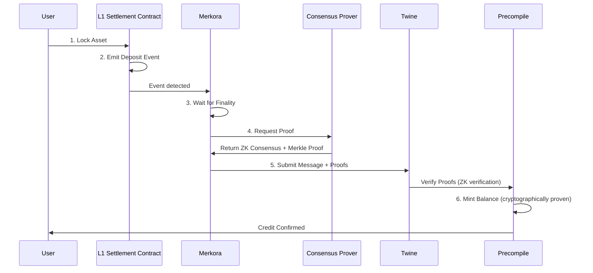
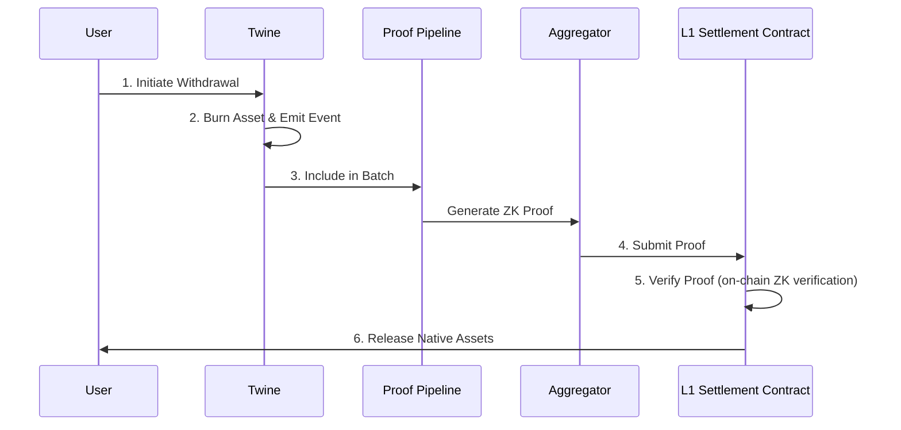
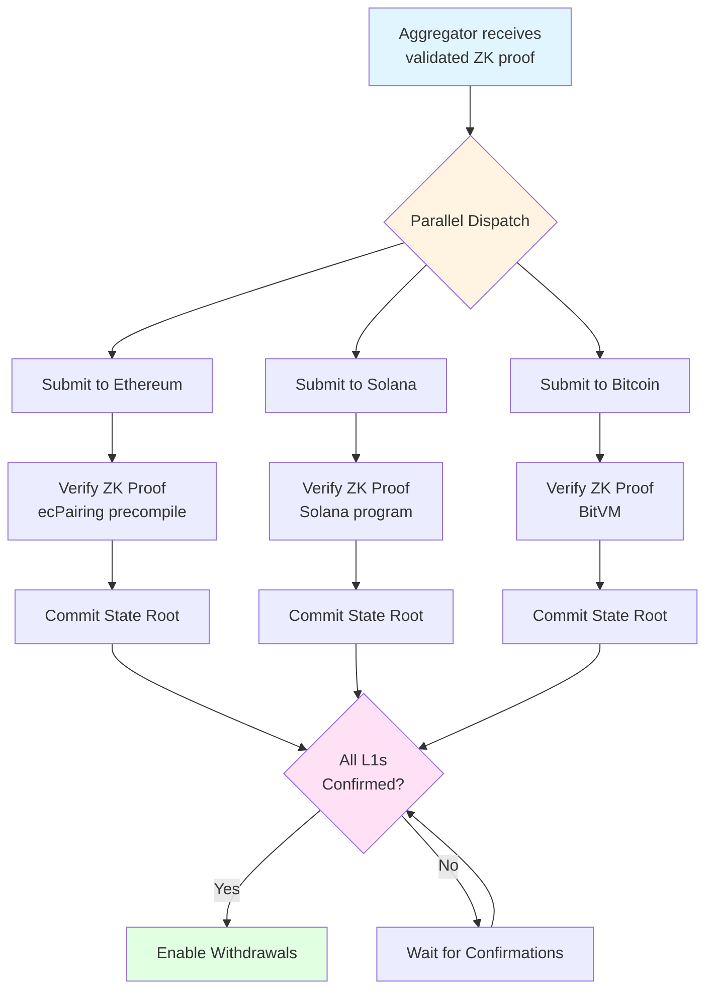

# Canonical Bridges & Settlement

[← Back to Architecture Overview](./Architecture.md)

Twine's canonical bridge architecture enables native multi-chain asset support **without wrapped tokens**, using cryptographic proofs to ensure **trust-minimized cross-chain transfers**.

## Trust Minimization

**Key Innovation**: Traditional bridges use multi-sig committees or trusted validators. Twine uses **zero-knowledge proofs verified on-chain**—no trust required.

| Traditional Bridges | Twine Canonical Bridges |
|---------------------|-------------------------|
| Multi-sig committees control funds | ZK proofs control fund release |
| Trust validator honesty | Verify cryptographic proofs |
| Wrapped tokens (trust assumption) | Native assets (no wrapping) |
| External oracle dependencies | On-chain proof verification |
| Bridge operator risk | Mathematically guaranteed security |

**Core Property**: Assets locked on Layer 1 can only be released with valid ZK proofs verified on-chain. No human intermediaries in the critical path.

## Multi-L1 Settlement Contracts

Settlement contracts deployed on each supported Layer 1 blockchain serve as the **trust anchor** for Twine's security model.

###  Ethereum Settlement Contracts

Twine deploys two primary contracts on Ethereum:

**1. L1MessageHandler (Message Queue Contract)**:
- Accepts deposits, withdrawals, and forced inclusions from users
- Emits `MessageTransaction` events tracked by Merkora
- Maintains nonce-ordered message queue
- Stores message hashes for state proof verification

**2. TwineChain (Settlement Contract)**:
- Stores Twine state root commitments via `FinalizedBatch` events
- **Verifies Groth16 execution proofs** via ecPairing precompile
- Processes withdrawal executions with `L2WithdrawExecuted` events
- Handles refunds via `RefundSuccessful` events
- Manages forced withdrawals via `ForcedWithdrawalSuccessful` events

**Key Ethereum Events** (from `twine-contract-docs`):

```solidity
// L1MessageHandler - User-initiated messages
event MessageTransaction(
    TwineTypes.TransactionType txnType,  // Deposit, Withdraw, Message
    uint64 nonce,
    uint64 chainId,
    uint64 blockNumber,
    address l1Token,
    address l2Token,
    address l1Address,
    address twineAddress,
    uint256 amount,
    bytes message
);

// TwineChain - Batch finalization (ZK proof verified on-chain)
event FinalizedBatch(
    uint64 indexed batchNumber,
    uint64 indexed messagesHandledOnTwine,
    uint64 chainId,
    uint256 blockNumber,
    bytes32 batchHash
);

// TwineChain - L2 withdrawal execution (cryptographically proven)
event L2WithdrawExecuted(
    uint64 nonce,
    string indexed l1Token,
    string l2Token,
    string indexed receiver,
    string indexed amount,
    uint256 blockNumber
);
```

**Trust Minimization**: Ethereum contracts verify ZK proofs using the ecPairing precompile—mathematical verification, no trust required.

### Solana Settlement Program

Twine deploys a Solana program that mirrors Ethereum functionality:

- On-chain program storing Twine state commitments
- **Verifies zero-knowledge proofs** (adapted for Solana runtime)
- Manages SOL and SPL token deposits and withdrawals
- Emits program events for cross-chain messaging
- Provides finality guarantees for Twine settlements

**Key Solana Events** (from `twine-contract-docs`):

```rust
// MessageTransaction - User-initiated deposits/withdrawals
pub struct MessageTransactionEvent {
    pub event: String,          // "MessageTransaction"
    pub nonce: u64,
    pub l1_pubkey: String,
    pub twine_address: String,
    pub l1_token: String,       // Program address
    pub l2_token: String,
    pub chain_id: u64,
    pub amount: String,
    pub data: Vec<u8>,
    pub message_type: String,   // "Deposit", "Withdraw", "Message"
    pub slot_number: u64,
}

// BatchCommitmentAndFinalizationSuccessful - Batch settlement (ZK proof verified)
pub struct FinalizedBatchEvent {
    pub event: String,        // "BatchCommitmentAndFinalizationSuccessful"
    pub batch_number: u64,
    pub messages_handled_on_twine: u64,
    pub chain_id: u64,
    pub batch_hash: [u8; 32],
    pub slot_number: u64,
}

// L2WithdrawExecuted - L2 withdrawal execution (cryptographically proven)
pub struct L2WithdrawExecutedEvent {
    pub event: String,           // "L2WithdrawExecuted"
    pub nonce: u64,
    pub l1_token: String,
    pub l2_token: String,
    pub l1_receiver: String,
    pub chain_id: u64,
    pub amount: u64,
    pub slot_number: u64,
}
```

**Trust Minimization**: Solana program verifies ZK proofs on-chain before accepting state updates—no external validators.

### Bitcoin Settlement (In Development)

- Uses **BitVM and derivative protocols** for fraud-proof interactive verification
- No Bitcoin protocol changes required—works with current Bitcoin rules
- Prover posts transactions encoding Twine state commitments and proofs
- Challengers can force revealing computation steps through interactive game
- On-chain dispute resolution if cheating is detected
- Supports verification of zero-knowledge proofs (SNARK/STARK) via SNARK-in-Script
- **Tradeoffs**: Complex protocol, potentially high on-chain cost in disputes, but **fully trustless**

**Trust Minimization**: BitVM fraud-proof game is self-enforcing—no trusted parties required.

### L2 Contract Events

On Twine L2, the `L2TwineMessenger` contract emits events:

```solidity
// SentMessage - User initiates withdrawal from Twine to L1
event SentMessage(
    address indexed from,
    address l2Token,
    string to,               // L1 recipient address
    string l1Token,
    uint256 amount,
    uint256 value,
    uint256 nonce,
    uint256 indexed chainId,
    uint256 blockNumber,
    uint256 gasLimit
);

// L1TransactionsHandled - L1 message processed on Twine
event L1TransactionsHandled(
    uint256 chainId,
    uint8 status,           // Success/failure status
    uint256 nonce,
    bytes transactionOutput
);

// ConsensusVerified - Consensus proof verification completed
event ConsensusVerified(bytes consensusProof);
```

## Native Asset Bridging

Unlike traditional bridges that create wrapped representations, Twine maintains **multiple native asset types** within a unified state.

### Multi-Native Asset Model

- `ETH` from Ethereum coexists with `SOL` from Solana in Twine state
- **No wrapping**: assets maintain their Layer 1 identity
- Balances tracked separately for each native asset type
- Smart contracts can operate on heterogeneous asset types

**Trust Minimization**: No wrapped tokens means no wrapped token trust assumptions. Assets are native or they don't exist.

### Deposit Flow (L1 → Twine)



**Trust Minimization**:
- Asset locked on L1 (verifiable on-chain)
- ZK consensus proof proves L1 block finality (no trust)
- Merkle proof proves transaction inclusion (no trust)
- Precompile verifies proofs cryptographically (no trust)

### Withdrawal Flow (Twine → L1)



**Trust Minimization**:
- Withdrawal initiation recorded on Twine
- ZK proof proves withdrawal legitimacy (no trust)
- L1 contract verifies proof on-chain (no trust)
- Assets only released after cryptographic verification

## Dual Proof Verification

All withdrawals employ a **dual-proof security mechanism** to prevent fraud:

### Proof of Withdrawal

**What**: Cryptographic proof that withdrawal was legitimately initiated on Twine

**Components**:
- Merkle proof of transaction inclusion in batch
- Proof that user had sufficient balance at time of withdrawal
- Proof of withdrawal event emission in Twine state
- ZK proof of correct state transition

**Trust Minimization**: Mathematical proof—cannot be faked or forged.

### Proof of Finality

**What**: Ensures Twine state containing the withdrawal is finalized on all relevant Layer 1s

**Why**: Prevents withdrawal of assets before multi-chain settlement completes

**Components**:
- Multi-chain settlement confirmation
- Proof that all Layer 1 settlement contracts accepted the state root
- Finality timestamp verification

**Trust Minimization**: Multi-chain finality means attack must compromise ALL settlement chains simultaneously.

### Verification Process

```solidity
function finalizeWithdrawal(
    address recipient,
    uint256 amount,
    bytes calldata withdrawalProof,
    bytes calldata finalityProof
) external {
    // Verify withdrawal was included in proven Twine state (ZK verification)
    require(verifyWithdrawalProof(withdrawalProof), "Invalid withdrawal");
    
    // Verify Twine state is finalized across all settlement chains
    require(verifyFinalityProof(finalityProof), "State not finalized");
    
    // Release assets to recipient (trust-minimized)
    _transfer(recipient, amount);
}
```

**Trust Minimization**: Both proofs verified cryptographically on-chain. No trusted intermediaries.

## Multi-Chain Settlement Coordination

### Settlement Flow



### Flow Steps

1. **Proof Generation**: Aggregator receives validated execution proof from proving network
2. **Parallel Dispatch**: Submits proof to settlement contracts on all Layer 1s simultaneously
3. **ZK Verification**: Each Layer 1 independently **verifies the zero-knowledge proof on-chain**
4. **State Commitment**: Layer 1 contracts update their view of Twine's state root
5. **Finality Tracking**: System marks batch as finalized once all Layer 1s confirm
6. **Withdrawal Enablement**: Users can claim withdrawals after multi-chain finality

**Trust Minimization**: Each step is cryptographically verifiable. No trusted coordinator.

### Consistency Guarantees

- All Layer 1 chains must verify the **same** Twine state root (deterministic)
- Withdrawals only processable after **all** settlement chains confirm (multi-chain finality)
- Atomic settlement across chains via proof verification (cryptographically enforced)
- No partial state updates across Layer 1s (all-or-nothing)

**Trust Minimization**: Consistency enforced by mathematics, not coordination.

## Security Properties

### No Bridge Operators

**Traditional**: Multi-sig committee controls bridge funds (trust assumption)

**Twine**: ZK proofs control fund release (no operators, no trust)

### No Wrapped Tokens

**Traditional**: Wrapped tokens introduce trust (can minter be trusted?)

**Twine**: Native assets only (no wrapping, no trust)

### No External Validators

**Traditional**: External validators attest to transfers (trust assumption)

**Twine**: On-chain ZK verification (no validators, no trust)

### Cryptographic Security

**Properties**:
- Assets locked on Layer 1 can only be released with valid ZK proof
- Proofs verified on-chain using precompiles/programs
- Security derives from Layer 1 chain security + ZK soundness
- No reliance on external parties

**Attack Resistance**:
- To steal funds: Must forge a ZK proof (computationally infeasible)
- To censor withdrawals: Users can force via Layer 1 (censorship-resistant)
- To halt bridge: Must compromise ALL settlement chains (multi-chain redundancy)

### Multi-Settlement Security Model

**Traditional L2**: Settles on single Layer 1 (single point of failure)

**Twine**: Settles on multiple Layer 1s simultaneously

**Security Benefits**:
- Withdrawal safe if **ANY** settlement chain remains honest
- Attack must compromise **ALL** settlement chains simultaneously
- Security improves as more Layer 1s are added (redundancy multiplies)
- Protects against Layer 1 failures or attacks

**Trust Minimization**: Security multiplies rather than fragments.

## Comparison with Traditional Bridges

| Feature | Traditional Bridges | Twine Canonical Bridges |
|---------|-------------------|-------------------------|
| **Asset Model** | Wrapped tokens | Native assets |
| **Security** | Multi-sig / Validators | ZK proofs verified on-chain |
| **Trust Assumptions** | Trust bridge operators | Zero trust—cryptographic verification |
| **Censorship Resistance** | Limited | Forced inclusion via L1 |
| **Settlement** | Single L1 | Multiple L1s simultaneously |
| **Failure Mode** | Bridge hack → total loss | Must compromise all L1s |
| **Verifiability** | Opaque | Publicly verifiable proofs |

**Twine's Advantage**: Replace **every trust assumption** with **cryptographic verification**.

## Developer Resources

- Contract ABIs and interfaces
- Event monitoring examples
- Proof construction guides
- Integration tutorials for multi-chain dApps

---

[← Back to Architecture Overview](./Architecture.md)

