# Consensus Verification System

[← Back to Architecture Overview](./Architecture.md)

Twine's universal consensus verification layer enables **trust-minimized verification of multiple Layer 1 blockchain states**, forming the foundation for canonical bridges without traditional trust assumptions.

## Overview

The consensus verification system is Twine's breakthrough innovation—cryptographically proving the state of heterogeneous blockchains using zero-knowledge proofs.

**Trust Minimization**: No reliance on external oracles, validator committees, or multi-sig bridges. Every Layer 1 blockchain state is verified through cryptographic consensus proofs that anyone can verify.

### Key Innovation

Traditional bridges rely on:
- ❌ Multi-sig committees (trust assumption)
- ❌ External validators (trust assumption)
- ❌ Oracles (trust assumption)

Twine's consensus proofs provide:
- ✅ Cryptographic verification of Layer 1 consensus
- ✅ Zero-knowledge proofs of blockchain state
- ✅ Publicly verifiable and reproducible
- ✅ No trusted intermediaries

## Multi-Chain Consensus Proving

### Supported Chains

**Ethereum**: Full consensus proof support via BLS signature aggregation
- Sync committee verification (lightweight, ~1 minute proving)
- Full attestation verification (maximum security, ~30 minutes proving)

**Solana**: First functional Solana zero-knowledge light client
- Stake-weighted vote verification
- Supermajority confirmation (66%+ stake)
- Optimized for 400ms slot time

**Bitcoin**: BitVM-based fraud-proof verification (in development)
- Interactive verification without protocol changes
- Fraud-proof dispute resolution
- SNARK-in-Script verification

**Future Chains**: Modular architecture for extensibility
- Any chain with verifiable consensus can be added
- No permission required from source chain
- Community can contribute new consensus provers

## Ethereum Consensus Verification

Twine implements two complementary approaches for Ethereum consensus verification, offering flexibility between speed and maximum security.

### Sync Committee Verification (Lightweight)

**What**: Verifies 512 randomly selected validators from Ethereum's sync committee

**How it Works**:
1. Sync committee rotates every ~27 hours (256 epochs)
2. 512 validators randomly selected from active validator set
3. Validators sign beacon block headers with BLS signatures
4. Twine aggregates signatures and generates ZK proof

**Technical Implementation**:
- Uses BLS12-381 signature aggregation in SP1 ZKVM
- Generates Groth16 proof for gas-efficient on-chain verification
- Verifies sync committee membership via Merkle proofs
- Extracts state root for account/storage verification

**Performance**:
- **Proving Time**: ~1 minute with BLS precompiles
- **Verification Cost**: ~300-500k gas on Ethereum
- **Security Level**: Honest majority of 512 validators required

**Use Cases**:
- Rapid finality confirmations
- Low-value deposits
- Time-sensitive cross-chain operations

**Trust Minimization**: While sync committee is not currently slashed (lower economic security than full attestations), it still provides cryptographic verification without external validators.

### Full Attestation Verification (Maximum Security)

**What**: Verifies up to 128 attestations representing ~30,000 BLS signatures from Ethereum's full validator set

**How it Works**:
1. Collect attestations from Ethereum beacon chain
2. Aggregate up to 128 attestations (each containing ~250 validator signatures)
3. Verify BLS signature aggregation in zero-knowledge
4. Generate Groth16 proof of full attestation verification
5. Extract state root with full crypto-economic security

**Technical Implementation**:
- BLS signature aggregation using zkSNARK-friendly precompiles in SP1
- Efficient validator set tracking across epochs
- Merkle proof verification for validator participation
- State root extraction for account/storage verification
- Optimized circuits for batch signature verification

**Performance**:
- **Proving Time**: ~30 minutes on SP1 Prover Network
- **Verification Cost**: ~300-500k gas (constant, independent of attestation count)
- **Security Level**: Full crypto-economic security from Ethereum validator set

**Use Cases**:
- High-value settlements
- Security-critical operations
- Large asset bridges
- Protocol-level state transitions

**Trust Minimization**: Inherits full Ethereum security—attacking requires compromising 2/3 of Ethereum's $XX billion stake. Completely trustless.

### State Root Extraction

Once consensus is verified, Twine extracts the Ethereum state root to enable account and storage verification:

**Process**:
1. Consensus proof validates beacon block header
2. Extract `execution_payload.state_root` from beacon block
3. Use state root to verify Merkle Patricia Trie proofs
4. Prove account balances, storage slots, contract code via EIP-1186 proofs

**Capabilities**:
- Verify ETH balances on Ethereum Layer 1
- Prove ERC-20 token balances in storage slots
- Access arbitrary contract state (read storage)
- Verify transaction inclusion in specific block

## Solana Consensus Verification

Twine implements the **first functional zero-knowledge Solana light client**, enabling trust-minimized verification of Solana blockchain state.

### Key Innovation

Solana's consensus is fundamentally different from Ethereum:
- Proof-of-Stake with stake-weighted voting
- Tower BFT consensus algorithm
- 400ms slot time (vs Ethereum's 12 seconds)
- No equivalent of Ethereum's sync committee

Twine's implementation proves Solana consensus in zero-knowledge without trusted intermediaries.

### How it Works

**1. Validator Stake Verification**:
- Fetch validator stake distribution from Solana
- Verify stake amounts via Merkle proofs in vote program accounts
- Track stake changes across epochs

**2. Vote Aggregation**:
- Collect vote transactions from Solana slots
- Verify Ed25519 signatures from validators in zero-knowledge
- Weight votes by validator stake
- Confirm supermajority (66%+ stake) voted for the block

**3. Finality Tracking**:
- **Optimistic Finality**: 2/3 stake voted (~400ms)
- **Absolute Finality**: Confirmed + 32 block confirmations (~13 seconds)
- Different finality levels for different security requirements

**4. Account State Extraction**:
- Extract Merkle root from verified Solana block
- Prove account data via Merkle proofs
- Verify SPL token balances, program states, etc.

### Technical Implementation

**Ed25519 Signature Verification in ZK**:
- Ed25519 signatures verified within SP1 ZKVM
- Optimized circuits for batch verification
- Efficient elliptic curve operations

**Stake-Weighted Vote Counting**:
- Circuit computes weighted vote total
- Verifies supermajority threshold (66%+ stake)
- Handles stake distribution changes

**Slot Time Optimization**:
- Optimized for Solana's 400ms slot time
- Batch processing for efficiency
- Incremental proof updates for rapid confirmations

**RPC Integration**:
- Fetches vote data from Solana RPC
- Queries stake distribution
- Retrieves account states for verification

### Performance Characteristics

| Metric | Value |
|--------|-------|
| **Proving Time** | ~2-5 minutes (batch of 100 slots) |
| **Finality** | 400ms (optimistic), ~13s (absolute) |
| **Verification Cost** | ~300-500k gas on Ethereum |
| **Throughput** | 100+ slots per proof |

### Security Model

**Stake-Weighted Security**:
- Requires 66%+ stake to produce valid blocks
- Attacking requires compromising 1/3+ of Solana stake
- Economic security from Solana's validator set

**Proof Chaining**:
- Rolling hash links consecutive proofs
- Prevents proof replay and ensures continuity
- Each proof builds on previous verified state

**Trust Minimization**: No Solana validators involved in proving—proofs generated off-chain and verified cryptographically. Trustless.

## Bitcoin State Verification

Twine uses **BitVM and derivative protocols** to enable trust-minimized Bitcoin state verification **without requiring Bitcoin protocol changes**.

### BitVM Fraud-Proof Architecture

**What is BitVM**: A system for verifiable computation on Bitcoin using fraud proofs and interactive verification games.

**Key Concept**: Instead of proving computation is correct, we assume it's correct and allow anyone to challenge. If challenged, an interactive game reveals the fraudulent step.

### How it Works

**1. Optimistic Assumption**:
- Prover posts Bitcoin state commitment to Twine
- Commitment includes: block hash, transaction data, UTXO state
- Posted optimistically—assumed correct unless challenged

**2. Challenge Period**:
- Time window (e.g., 24 hours) for anyone to challenge commitment
- Challenger stakes collateral to prevent spam
- If no challenge, commitment is accepted

**3. Interactive Verification Game**:
- Challenger disputes specific claim
- Prover and challenger engage in bisection protocol
- Each round narrows down dispute to smaller computation
- Eventually reaches single step of computation

**4. On-Chain Resolution**:
- Final computation step executed in Bitcoin script
- Bitcoin script verifies the disputed computation
- Fraudulent party's collateral is slashed
- Correct party rewarded

**5. SNARK-in-Script**:
- Bitcoin script can verify zero-knowledge proofs
- Enables verification of complex computations
- Works with existing Bitcoin opcodes

### Technical Mechanism

**Bitcoin Transactions & Scripts**:
- Uses standard Bitcoin transaction structure
- No soft fork or protocol upgrade required
- Works with current Bitcoin consensus rules

**Commitment Encoding**:
- Prover posts hash of Bitcoin block header
- Includes Merkle root for transaction verification
- UTXO set commitment for state verification

**Bisection Protocol**:
- Computation divided into N steps
- Binary search to find first disagreement
- O(log N) rounds to isolate fraud
- Final step verified on-chain

### Key Capabilities

**Bitcoin Block Header Verification**:
- Verify proof-of-work validity
- Confirm block hash meets difficulty target
- Validate block header chain continuity

**Transaction Inclusion Proofs**:
- Prove transaction included in Bitcoin block via Merkle proofs
- Verify transaction outputs (deposit events)
- Extract UTXO state for bridging

**UTXO State Verification**:
- Cryptographically verify UTXO set state
- Prove specific outputs exist and are unspent
- Enable trust-minimized Bitcoin deposits/withdrawals

**Trust Minimization**: No trusted intermediaries—fraud-proof game is self-enforcing. Anyone can challenge invalid claims.

### Tradeoffs

**Pros**:
- ✅ Works with current Bitcoin (no protocol changes)
- ✅ Fully trustless (no central parties)
- ✅ Fraud-proof based (economic security)
- ✅ Supports SNARK verification

**Cons**:
- ❌ Complex protocol design
- ❌ High on-chain cost in worst-case disputes
- ❌ Longer finality times during challenges (24+ hours)
- ❌ Requires active challenger network

**Alternative Approaches**:
- Optimistic verification with watchtower network
- Threshold signatures from Bitcoin validators
- Hybrid approach with ZK proofs for non-disputed cases

### Implementation Status

- **Current**: Active development with BitVM research community
- **Collaboration**: Working on SNARK verification in Bitcoin script
- **Testnet**: Planned deployment Q1 2025
- **Production**: Contingent on BitVM protocol maturity

## Consensus Proof Integration

### Key Functions

**L1 State Verification**:
- Cryptographically prove Layer 1 blockchain states
- No reliance on external oracles or validators
- Verifiable by anyone with access to Layer 1 data

**Block Finality Confirmation**:
- Ensure deposit/withdrawal transactions are irreversible
- Prevent re-org attacks and double-spends
- Different finality levels per chain (Ethereum: 32 blocks, Solana: 32 slots, Bitcoin: 6 confirmations)

**Canonical Bridge Security**:
- Eliminate trust assumptions in asset transfers
- Assets locked/released based on cryptographic proof
- No multi-sig committees or bridge operators

**Event Verification**:
- Prove transaction inclusion in specific blocks
- Verify event emissions (deposits, withdrawals)
- Extract event parameters for cross-chain messaging

### Checkpoint System

**Genesis Checkpoints**:
- Trusted checkpoints embedded in Twine genesis for each blockchain
- Provides starting point for consensus verification
- Checkpoints chosen from well-confirmed blocks

**Checkpoint Advancement**:
- New checkpoints verified through consensus proofs
- Each proof extends chain of verified state
- Checkpoint updates proposed via governance

**Permissionless Proving** (Future):
- Currently: Whitelisted proof provisioning for testnet security
- Future: Fully permissionless—anyone can submit consensus proofs
- Proof validity verified on-chain (trustless)

### Security Model

**No External Dependencies**:
- No reliance on external oracles (trust-minimized)
- No multi-sig committees (trust-minimized)
- No validator attestations (trust-minimized)

**Cryptographic Verification**:
- All consensus proofs verified cryptographically
- On-chain verification ensures correctness
- Publicly verifiable and reproducible

**Proof Generation Decentralization**:
- Anyone can generate consensus proofs (open-source)
- Proof generation can be verified independently
- No single point of failure

**Security Inherits from Source Chain**:
- Ethereum: Full economic security from $XX billion stake
- Solana: Stake-weighted consensus security
- Bitcoin: Proof-of-work + fraud-proof security

## Implementation Architecture

### Proof Generation Flow

```mermaid
flowchart LR
    L1[Layer 1 Blockchain] --> Fetch[Fetch Consensus Data]
    Fetch --> Aggregate[Aggregate Signatures/Votes]
    Aggregate --> ZKVM[Generate ZK Proof in SP1]
    ZKVM --> Compress[Compress to Groth16]
    Compress --> Submit[Submit to Twine Settlement]
    Submit --> Verify[On-Chain Verification]
    Verify --> StateRoot[Extract State Root]
    StateRoot --> Precompiles[Available to zkBridge Precompiles]
```

### Components

**Consensus Data Fetchers**:
- Ethereum: Beacon chain API for sync committee / attestations
- Solana: RPC for vote transactions and stake distribution
- Bitcoin: Full node for block headers and transaction data

**Proof Generators**:
- SP1 ZKVM for zero-knowledge proof generation
- BLS aggregation circuits (Ethereum)
- Ed25519 verification circuits (Solana)
- Bitcoin script verification (BitVM)

**Proof Compression**:
- Raw zkVM proofs compressed to Groth16
- Constant-size proofs (~256 bytes)
- Constant-time verification (~300-500k gas)

**Settlement Integration**:
- Proofs submitted to Twine settlement contracts on Layer 1
- On-chain verification before state updates
- State roots made available to execution layer

## Trust Minimization Summary

| Traditional Bridges | Twine Consensus Proofs |
|-------------------|----------------------|
| Multi-sig committees | Zero-knowledge proofs |
| External validators | Cryptographic verification |
| Oracle networks | Direct consensus verification |
| Trust assumptions | Mathematical guarantees |
| Centralized operators | Permissionless proving |
| Opaque verification | Publicly verifiable |

**Twine's Philosophy**: Replace every trust assumption with cryptographic verification. If it can be proven mathematically, it should be.

---

[← Back to Architecture Overview](./Architecture.md)

