# Consensus Verification System

[← Back to Architecture Overview](./Architecture.md)

Twine's universal consensus verification layer enables **trust-minimized verification of multiple Layer 1 blockchain states**, forming the foundation for canonical bridges without traditional trust assumptions.

## Overview

The consensus verification system is Twine's breakthrough innovation—cryptographically proving the state of heterogeneous blockchains using zero-knowledge proofs.

**Trust Minimization**: No reliance on external oracles, validator committees, or multi-sig bridges. Every Layer 1 blockchain state is verified through cryptographic consensus proofs that anyone can verify.

### Key Innovation

Traditional bridges rely on:
- ❌ Multi-sig committees (trust assumption)
- ❌ External validators (trust assumption)
- ❌ Oracles (trust assumption)

Twine's consensus proofs provide:
- ✅ Cryptographic verification of Layer 1 consensus
- ✅ Zero-knowledge proofs of blockchain state
- ✅ Publicly verifiable and reproducible
- ✅ No trusted intermediaries

### Current Implementation: ZKVM Consensus Provers

**Production Status**: Twine's consensus provers are currently implemented on **SP1** and **Risc0** zero-knowledge virtual machines, providing trust-minimized verification of Ethereum and Solana consensus.

**SP1 ZKVM**:
- BLS12-381 signature aggregation for Ethereum
- Ed25519 signature verification for Solana
- Efficient pairing operations and elliptic curve arithmetic
- Production-ready with proven security properties

**Risc0 ZKVM**:
- Alternative ZKVM implementation for consensus proving
- Different performance characteristics and optimization strategies
- Provides redundancy and proving system diversity

### Future Optimization: GKR Protocol (In Development)

**GKR (Goldwasser-Kalai-Rothblum)** is being developed to significantly improve consensus proving efficiency ([see Vitalik's GKR Tutorial](https://vitalik.eth.limo/general/2025/10/19/gkr.html)).

**The Efficiency Problem with Current Approach**:

Traditional ZK-SNARKs (including current ZKVM implementations):
- Must commit to intermediate verification steps (Merkle trees or KZG commitments)
- Hashing 4-16 bytes for each byte of intermediate data
- ~100x overhead vs naive computation
- Memory-intensive commitment operations

**GKR's Solution** (Planned):

GKR is designed for computations with "batch and layers" structure:
- **Batch**: Same function applied to many inputs (e.g., 65,536 validator attestations)
- **Layers**: Processing through multiple computational steps (verify → aggregate → threshold check)

**Key Innovation**: GKR **avoids committing to intermediate layers**:
- Only commit to inputs (validator keys, signatures, stake amounts)
- Only commit to outputs (consensus result, finalized block hash)
- Everything in between uses efficient "sumchecks" instead of commitments
- Achieves ~10-15x overhead vs naive computation

**Why This Matters for Consensus**:

Ethereum example (full attestations):
- Up to 65,536 attestations (256×256) → verify each → aggregate → check threshold
- Current ZKVM: Commit to verification results at multiple layers (~100x overhead)
- **Future GKR**: Prove the final threshold result directly using sumchecks (~10-15x overhead)

Solana example:
- 1000+ validator votes → verify Ed25519 sigs → weight by stake → sum → check 66% threshold
- Current ZKVM: Commit at each layer (signatures, stakes, weighted votes, sum)
- **Future GKR**: Only commit to inputs and final consensus result

**Expected Result**: 7-10x faster consensus proving while maintaining the same security guarantees.

**Trust Minimization**: GKR is a proving technique, not a trust assumption. The proof remains cryptographically sound and verifiable on-chain.

## Multi-Chain Consensus Proving

### Supported Chains

**Ethereum**: Full consensus proof support via BLS signature aggregation
- Sync committee verification (lightweight, ~1 minute proving)
- Full attestation verification (maximum security, ~30 minutes proving)

**Solana**: First functional Solana zero-knowledge light client
- Stake-weighted vote verification
- Supermajority confirmation (66%+ stake)
- Optimized for 400ms slot time

**Bitcoin**: BitVM-based fraud-proof verification (in development)
- Interactive verification without protocol changes
- Fraud-proof dispute resolution
- SNARK-in-Script verification

**Future Chains**: Modular architecture for extensibility
- Any chain with verifiable consensus can be added
- No permission required from source chain
- Community can contribute new consensus provers

## Ethereum Consensus Verification

Twine implements two complementary approaches for Ethereum consensus verification, offering flexibility between speed and maximum security. Both approaches verify **all Ethereum consensus constraints** cryptographically using zero-knowledge proofs.

### Consensus Constraint Verification

Twine's Ethereum consensus proofs verify the complete set of consensus rules:

**Signature Verification Constraints**:
- BLS12-381 signature aggregation from validators
- Validator public key membership in active validator set
- Correct signature formatting and domain separation

**Validator Set Constraints**:
- Validator registration and stake verification
- Sync committee membership proofs via Merkle inclusion
- Epoch boundary transitions and committee rotations

**Block Validity Constraints**:
- Block slot number progression (monotonically increasing)
- Parent block hash linking (chain continuity)
- State root coherence with previous state
- Block timestamp within acceptable drift bounds

**Finality Constraints**:
- Sufficient validator participation (supermajority)
- Justification and finalization checkpoints
- Attestation target and source consistency

**Trust Minimization**: Every constraint is verified cryptographically in the ZK circuit—no assumption that validators are honest, only that cryptography is sound.

### Sync Committee Verification (Lightweight)

**What**: Verifies 512 randomly selected validators from Ethereum's sync committee

**How it Works**:
1. Sync committee rotates every ~27 hours (256 epochs)
2. 512 validators randomly selected from active validator set
3. Validators sign beacon block headers with BLS signatures
4. Twine aggregates signatures and generates ZK proof using **SP1/Risc0 ZKVM**

**Current Proving System (Production)**:

**SP1 ZKVM Implementation**:
- BLS12-381 signature aggregation executed in SP1 ZKVM
- BLS precompiles for efficient pairing operations
- Merkle proof verification for sync committee membership
- Batch verification of 512 validator signatures
- Overall circuit coordination and constraint checking
- Groth16 proof compression for on-chain verification

**Risc0 ZKVM Alternative**:
- Alternative ZKVM implementation providing proving system diversity
- Different optimization strategies and performance characteristics
- Fallback option for proving redundancy

**Current Performance**:
- **Proving Time**: ~1-2 minutes with BLS precompiles
- **Verification Cost**: ~300-500k gas on Ethereum (constant time)
- **Security Level**: Honest majority of 512 validators required
- **Proof Size**: ~256 bytes (Groth16 compressed)

**Future Optimization with GKR** (In Development):

**GKR for Batch Processing** ([see Vitalik's GKR post](https://vitalik.eth.limo/general/2025/10/19/gkr.html)):
- Will process 512 validator signatures in parallel with minimal overhead
- Avoids committing to intermediate verification steps
- Only commits to inputs (validator keys, signatures) and outputs (verification result)
- **Expected improvement**: ~7-10x faster proving (from ~1-2 minutes to ~10-15 seconds)
- Achieves ~10-15x overhead vs naive computation (compared to current ~100x)

**Why GKR Will Be Critical** (When Launched):
- **Efficiency**: Proving 512 BLS signatures without intermediate Merkle tree commitments
- **Low Overhead**: GKR adds only 10-15x overhead vs current ~100x overhead
- **Parallelization**: Batch structure (512 validators) maps perfectly to GKR's "batch and layers" pattern
- **Memory Efficiency**: Avoids expensive commitment operations at each proving layer

**Use Cases**:
- Rapid finality confirmations
- Low-value deposits (<$10K equivalent)
- Time-sensitive cross-chain operations
- High-frequency state queries

**Trust Minimization**: While sync committee is not currently slashed (lower economic security than full attestations), it still provides cryptographic verification of all consensus constraints without external validators.

### Full Attestation Verification (Maximum Security)

**What**: Verifies up to **65,536 attestations (256×256)** from Ethereum's validator set of up to **2 million validators**

**Scale**:
- Ethereum's validator set: Up to ~2,000,000 active validators
- Each attestation: Aggregated BLS signature from multiple validators
- Max capacity: 256 attestations × 256 sub-aggregations = 65,536 validator signatures per proof
- Represents full crypto-economic security of Ethereum

**How it Works**:
1. Collect attestations from Ethereum beacon chain for a specific slot
2. Aggregate up to 65,536 validator signatures (256×256 structure)
3. Verify BLS signature aggregation in zero-knowledge using **SP1/Risc0 ZKVM**
4. Generate Groth16 proof of full attestation verification
5. Extract state root with full crypto-economic security

**Current Proving System (Production)**:

**SP1 ZKVM Implementation**:
- BLS12-381 signature aggregation executed in SP1 ZKVM
- Efficient BLS pairing operations using precompiles
- Handles up to 65,536 validator signatures per proof
- Merkle proof verification for validator participation from 2M+ validator set
- Manages epoch transitions and validator set updates
- Coordinates overall constraint verification

**Risc0 ZKVM Alternative**:
- Alternative implementation for proving system redundancy
- Different optimization strategies for large-scale signature verification
- Fallback option ensuring continuous operation

**Constraint Verification in ZK Circuit**:
- Verify each of 65,536 validators signed the correct beacon block header
- Prove validator stake amounts from beacon state (from up to 2M validator registry)
- Confirm supermajority threshold (2/3+ of total stake)
- Check attestation target and source consistency
- Validate epoch boundary conditions
- Verify committee inclusion proofs from full validator set

**Current Performance**:
- **Proving Time**: ~30-45 minutes on SP1 Prover Network (65,536 signatures)
- **Verification Cost**: ~300-500k gas (constant, independent of attestation count)
- **Security Level**: Full crypto-economic security from Ethereum validator set
- **Proof Size**: ~256 bytes (Groth16 compressed)
- **Validator Set**: Up to 2,000,000 validators supported
- **Attestations per Proof**: Up to 65,536 (256×256)

**Future Optimization with GKR** (In Development):

**GKR for Massive Batch Signature Verification**:
- Will process 65,536 signatures in "batch and layers" pattern with minimal overhead
- Layer structure:
  - **Layer 1**: Individual BLS signature verifications (65,536 parallel operations)
  - **Layer 2**: Aggregation of verification results
  - **Layer 3**: Final consensus check (supermajority threshold)
- **Key Efficiency**: No commitments to intermediate verification states
- **Expected improvement**: 7-10x faster proving (from ~30-45 minutes to ~3-5 minutes)
- Achieves ~10-15x overhead vs naive computation

**Why GKR is Critical at This Scale**:
- Current: Must commit to results of 65,536 signature verifications (~100x overhead)
- Future with GKR: Only commit to inputs and final result (~10-15x overhead)
- **Performance Impact**: Makes proving 2M+ validator set practical for production

**Use Cases**:
- High-value settlements (>$100K equivalent)
- Security-critical operations
- Large asset bridges
- Protocol-level state transitions
- Initial bootstrap after sync committee compromise

**Trust Minimization**: Inherits full Ethereum security—attacking requires compromising 2/3 of Ethereum's $XX billion stake. Every consensus rule verified cryptographically. Completely trustless.

### State Root Extraction

Once consensus is verified, Twine extracts the Ethereum state root to enable account and storage verification:

**Process**:
1. Consensus proof validates beacon block header
2. Extract `execution_payload.state_root` from beacon block
3. Use state root to verify Merkle Patricia Trie proofs
4. Prove account balances, storage slots, contract code via EIP-1186 proofs

**Capabilities**:
- Verify ETH balances on Ethereum Layer 1
- Prove ERC-20 token balances in storage slots
- Access arbitrary contract state (read storage)
- Verify transaction inclusion in specific block

## Solana Consensus Verification

Twine implements the **first functional zero-knowledge Solana light client**, enabling trust-minimized verification of Solana blockchain state through complete constraint verification.

### Key Innovation

Solana's consensus is fundamentally different from Ethereum:
- Proof-of-Stake with stake-weighted voting
- Tower BFT consensus algorithm  
- 400ms slot time (vs Ethereum's 12 seconds)
- No equivalent of Ethereum's sync committee
- Votes are Ed25519 signatures (not BLS aggregation)

**Twine's Breakthrough**: First functional implementation proving Solana consensus in zero-knowledge without trusted intermediaries. Verifies **all Solana consensus constraints** cryptographically using ZKVM + GKR.

> **Note**: This represents a significant advancement in cross-chain infrastructure. Prior to Twine, no production-ready zero-knowledge Solana light client existed. Twine's implementation combines SP1 ZKVM for Ed25519 verification with GKR protocol for efficient batch processing of validator votes, enabling trust-minimized Solana state verification at scale.

### Consensus Constraint Verification

Twine's Solana consensus proofs verify the complete set of Solana consensus rules:

**Vote Signature Constraints**:
- Ed25519 signature verification for each validator vote
- Vote transaction structure and formatting validation
- Tower BFT lockout period enforcement
- Vote account ownership verification

**Validator Stake Constraints**:
- Validator registration and identity verification
- Stake amount proofs from vote program accounts
- Stake delegation and withdrawal tracking
- Epoch stake weight calculations

**Block Validity Constraints**:
- Slot number progression (monotonically increasing)
- Parent block hash linking (fork choice validity)
- Block hash computation correctness
- Bank hash and accounts hash verification

**Consensus Threshold Constraints**:
- Supermajority requirement (66%+ of total stake)
- Stake-weighted vote counting accuracy
- Optimistic vs absolute finality thresholds
- Fork resolution via heaviest fork rule

**Tower BFT Specific Constraints**:
- Lockout period enforcement (exponential backoff)
- Confirmation depth tracking
- Rooted slot advancement rules
- Vote switch slashing prevention

**Trust Minimization**: Every Solana consensus rule is verified in the ZK circuit—no assumption of honest validators, only cryptographic soundness.

### How it Works

**1. Validator Stake Verification**:
- Fetch validator stake distribution from Solana vote program accounts
- Verify stake amounts via Merkle proofs in account state
- Track stake changes across epochs (~2.5 days)
- Compute total active stake for threshold calculations

**2. Vote Aggregation and Verification**:

**Current Implementation (Production)**:

**SP1 ZKVM for Signature Verification**:
- Ed25519 signatures verified in SP1 ZKVM
- Each validator's vote transaction signature checked cryptographically
- Vote account state proofs validated via Merkle inclusion
- Batch verification of hundreds to thousands of validator votes
- Stake-weighted vote counting and threshold verification

**Risc0 ZKVM Alternative**:
- Alternative ZKVM implementation for proving redundancy
- Different performance characteristics for Solana consensus
- Ensures continuous light client operation

**Current Performance**:
- **Proving Time**: ~2-5 minutes (batch of 100 slots, 500-1500 validators per slot)
- **Validator Capacity**: Up to 3,000 validators per proof
- **Overhead**: ~100x vs naive computation (current ZKVM approach)

**Future Optimization with GKR** (In Development):

**GKR for Batch Vote Processing** ([GKR protocol](https://vitalik.eth.limo/general/2025/10/19/gkr.html)):
- Will process thousands of validator votes in parallel with minimal overhead
- Layer structure:
  - **Layer 1**: Individual Ed25519 signature verifications (parallel, same function)
  - **Layer 2**: Stake weight lookups and multiplications
  - **Layer 3**: Weighted vote summation
  - **Layer 4**: Threshold check (66%+ stake requirement)
- **Key Efficiency**: No intermediate commitments—only commit to vote data (input) and consensus result (output)
- **Expected improvement**: 7-10x faster proving (from ~2-5 minutes to ~20-40 seconds per 100 slots)
- Target overhead: ~10-15x vs naive computation

**Why GKR Will Be Critical for Solana** (When Launched):
- **High Frequency**: Solana's 400ms slot time benefits greatly from faster proving
- **Batch Structure**: Hundreds of validators voting in parallel fits GKR's "batch and layers" pattern perfectly
- **Low Overhead**: GKR's efficiency enables near-real-time consensus proving
- **Memory Efficiency**: Avoids expensive Merkle tree commitments at each verification layer
- **Scalability**: Handle validator set growth without linear proving cost increase

**3. Finality Tracking**:
- **Optimistic Finality**: 2/3 stake voted (~400ms, 1 slot confirmation)
- **Absolute Finality**: Confirmed + 32 slot confirmations (~13 seconds)
- **Rooted Finality**: 2/3 stake confirmed via Tower BFT lockouts (~3 seconds)
- Different finality levels for different security requirements

**4. Account State Extraction**:
- Extract account state root from verified Solana block
- Prove account data via Merkle proofs (accounts delta hash)
- Verify SPL token balances, program states, PDAs
- Support for any account state in verified blocks

### Technical Implementation

**Current ZKVM Implementation**:

**Ed25519 Signature Verification in SP1/Risc0**:
- Ed25519 signatures verified within SP1 ZKVM using optimized elliptic curve circuits
- Curve25519 point operations for public key recovery
- Batch signature verification across multiple validators (up to 3,000 per proof)
- Efficient elliptic curve arithmetic in ZKVM
- Stake-weighted vote counting and threshold checking

**Constraint Verification Circuit** (Current):
```
Inputs: [validator_pubkeys[], vote_sigs[], stake_amounts[], block_hash]
  ↓
SP1/Risc0 ZKVM:
  - Verify Ed25519(vote_sig[i], validator_pubkey[i], block_hash) ∀i
  - Fetch stake_weight[i] for each validator
  - Compute weighted_votes = Σ(vote_valid[i] × stake_weight[i])
  - Verify weighted_votes ≥ 0.66 × total_stake
  ↓
Output: [consensus_valid: bool, block_hash: bytes32]
```

**Future GKR-Optimized Circuit** (In Development):
```
Inputs: [validator_pubkeys[], vote_sigs[], stake_amounts[], block_hash]
  ↓
Layer 1: Verify Ed25519(vote_sig[i], validator_pubkey[i], block_hash) ∀i (parallel)
  ↓ GKR sumcheck (no commitment to intermediate results)
Layer 2: Fetch stake_weight[i] for each validator (parallel)
  ↓ GKR sumcheck
Layer 3: Compute weighted_votes = Σ(vote_valid[i] × stake_weight[i])
  ↓ GKR sumcheck  
Layer 4: Verify weighted_votes ≥ 0.66 × total_stake
  ↓
Output: [consensus_valid: bool, block_hash: bytes32]
```

**Slot Time Optimization**:
- Current: Optimized for Solana's 400ms slot time with batch proving
- Batch processing: Prove 100 slots together (~40 seconds of Solana time)
- Incremental proof updates for rapid confirmations
- Future: GKR will enable even faster proving despite high validator count

**RPC Integration**:
- Fetches vote data from Solana RPC (`getConfirmedSignaturesForAddress2`)
- Queries stake distribution from vote program accounts
- Retrieves account states for verification via `getAccountInfo`
- Monitors epoch boundaries for stake updates

**Rolling Hash Proof Chaining**:
- Each proof includes `prev_rolling_hash` from previous proof
- Creates cryptographic chain: `new_hash = Hash(prev_hash || current_proof_data)`
- Prevents proof replay and ensures sequential verification
- Enables continuous light client operation

### Performance Characteristics

**Current (SP1/Risc0 ZKVM)**:

| Metric | Value |
|--------|-------|
| **Proving Time** | ~2-5 minutes (batch of 100 slots) |
| **Finality** | 400ms (optimistic), ~13s (absolute), ~3s (rooted) |
| **Verification Cost** | ~300-500k gas on Ethereum (Groth16) |
| **Throughput** | 100+ slots per proof |
| **Proof Size** | ~256 bytes (Groth16 compressed) |
| **Overhead** | ~100x vs naive computation |
| **Validators per Slot** | 500-1500 validators (Solana mainnet) |
| **Max Validators per Proof** | ~3,000 validators |

**Future (With GKR Optimization)**:

| Metric | Value |
|--------|-------|
| **Proving Time** | ~20-40 seconds (batch of 100 slots) |
| **Overhead** | ~10-15x vs naive computation |
| **Improvement** | 7-10x faster proving |
| **Validators per Slot** | 500-1500+ validators (no degradation with growth) |
| **Max Validators per Proof** | 10,000+ validators (scalable) |

### Security Model

**Stake-Weighted Security**:
- Requires 66%+ stake to produce valid blocks
- Attacking requires compromising 1/3+ of Solana stake
- Economic security from Solana's validator set

**Proof Chaining**:
- Rolling hash links consecutive proofs
- Prevents proof replay and ensures continuity
- Each proof builds on previous verified state

**Trust Minimization**: No Solana validators involved in proving—proofs generated off-chain and verified cryptographically. Trustless.

## Bitcoin State Verification

Twine uses **BitVM and derivative protocols** to enable trust-minimized Bitcoin state verification **without requiring Bitcoin protocol changes**.

### BitVM Fraud-Proof Architecture

**What is BitVM**: A system for verifiable computation on Bitcoin using fraud proofs and interactive verification games.

**Key Concept**: Instead of proving computation is correct, we assume it's correct and allow anyone to challenge. If challenged, an interactive game reveals the fraudulent step.

### How it Works

**1. Optimistic Assumption**:
- Prover posts Bitcoin state commitment to Twine
- Commitment includes: block hash, transaction data, UTXO state
- Posted optimistically—assumed correct unless challenged

**2. Challenge Period**:
- Time window (e.g., 24 hours) for anyone to challenge commitment
- Challenger stakes collateral to prevent spam
- If no challenge, commitment is accepted

**3. Interactive Verification Game**:
- Challenger disputes specific claim
- Prover and challenger engage in bisection protocol
- Each round narrows down dispute to smaller computation
- Eventually reaches single step of computation

**4. On-Chain Resolution**:
- Final computation step executed in Bitcoin script
- Bitcoin script verifies the disputed computation
- Fraudulent party's collateral is slashed
- Correct party rewarded

**5. SNARK-in-Script**:
- Bitcoin script can verify zero-knowledge proofs
- Enables verification of complex computations
- Works with existing Bitcoin opcodes

### Technical Mechanism

**Bitcoin Transactions & Scripts**:
- Uses standard Bitcoin transaction structure
- No soft fork or protocol upgrade required
- Works with current Bitcoin consensus rules

**Commitment Encoding**:
- Prover posts hash of Bitcoin block header
- Includes Merkle root for transaction verification
- UTXO set commitment for state verification

**Bisection Protocol**:
- Computation divided into N steps
- Binary search to find first disagreement
- O(log N) rounds to isolate fraud
- Final step verified on-chain

### Key Capabilities

**Bitcoin Block Header Verification**:
- Verify proof-of-work validity
- Confirm block hash meets difficulty target
- Validate block header chain continuity

**Transaction Inclusion Proofs**:
- Prove transaction included in Bitcoin block via Merkle proofs
- Verify transaction outputs (deposit events)
- Extract UTXO state for bridging

**UTXO State Verification**:
- Cryptographically verify UTXO set state
- Prove specific outputs exist and are unspent
- Enable trust-minimized Bitcoin deposits/withdrawals

**Trust Minimization**: No trusted intermediaries—fraud-proof game is self-enforcing. Anyone can challenge invalid claims.

### Tradeoffs

**Pros**:
- ✅ Works with current Bitcoin (no protocol changes)
- ✅ Fully trustless (no central parties)
- ✅ Fraud-proof based (economic security)
- ✅ Supports SNARK verification

**Cons**:
- ❌ Complex protocol design
- ❌ High on-chain cost in worst-case disputes
- ❌ Longer finality times during challenges (24+ hours)
- ❌ Requires active challenger network

**Alternative Approaches**:
- Optimistic verification with watchtower network
- Threshold signatures from Bitcoin validators
- Hybrid approach with ZK proofs for non-disputed cases

### Implementation Status

- **Current**: Active development with BitVM research community
- **Collaboration**: Working on SNARK verification in Bitcoin script
- **Testnet**: Planned deployment Q1 2025
- **Production**: Contingent on BitVM protocol maturity

## Consensus Proof Integration

### Key Functions

**L1 State Verification**:
- Cryptographically prove Layer 1 blockchain states
- No reliance on external oracles or validators
- Verifiable by anyone with access to Layer 1 data

**Block Finality Confirmation**:
- Ensure deposit/withdrawal transactions are irreversible
- Prevent re-org attacks and double-spends
- Different finality levels per chain (Ethereum: 32 blocks, Solana: 32 slots, Bitcoin: 6 confirmations)

**Canonical Bridge Security**:
- Eliminate trust assumptions in asset transfers
- Assets locked/released based on cryptographic proof
- No multi-sig committees or bridge operators

**Event Verification**:
- Prove transaction inclusion in specific blocks
- Verify event emissions (deposits, withdrawals)
- Extract event parameters for cross-chain messaging

### Checkpoint System

**Genesis Checkpoints**:
- Trusted checkpoints embedded in Twine genesis for each blockchain
- Provides starting point for consensus verification
- Checkpoints chosen from well-confirmed blocks

**Checkpoint Advancement**:
- New checkpoints verified through consensus proofs
- Each proof extends chain of verified state
- Checkpoint updates proposed via governance

**Permissionless Proving** (Future):
- Currently: Whitelisted proof provisioning for testnet security
- Future: Fully permissionless—anyone can submit consensus proofs
- Proof validity verified on-chain (trustless)

### Security Model

**No External Dependencies**:
- No reliance on external oracles (trust-minimized)
- No multi-sig committees (trust-minimized)
- No validator attestations (trust-minimized)

**Cryptographic Verification**:
- All consensus proofs verified cryptographically
- On-chain verification ensures correctness
- Publicly verifiable and reproducible

**Proof Generation Decentralization**:
- Anyone can generate consensus proofs (open-source)
- Proof generation can be verified independently
- No single point of failure

**Security Inherits from Source Chain**:
- Ethereum: Full economic security from $XX billion stake
- Solana: Stake-weighted consensus security
- Bitcoin: Proof-of-work + fraud-proof security

## Implementation Architecture

### Proof Generation Flow

```mermaid
flowchart LR
    L1[Layer 1 Blockchain] --> Fetch[Fetch Consensus Data]
    Fetch --> Aggregate[Aggregate Signatures/Votes]
    Aggregate --> ZKVM[Generate ZK Proof in SP1]
    ZKVM --> Compress[Compress to Groth16]
    Compress --> Submit[Submit to Twine Settlement]
    Submit --> Verify[On-Chain Verification]
    Verify --> StateRoot[Extract State Root]
    StateRoot --> Precompiles[Available to zkBridge Precompiles]
```



### Components

**Consensus Data Fetchers**:
- Ethereum: Beacon chain API for sync committee / attestations
- Solana: RPC for vote transactions and stake distribution
- Bitcoin: Full node for block headers and transaction data

**Proof Generators**:
- SP1 ZKVM for zero-knowledge proof generation
- BLS aggregation circuits (Ethereum)
- Ed25519 verification circuits (Solana)
- Bitcoin script verification (BitVM)

**Proof Compression**:
- Raw zkVM proofs compressed to Groth16
- Constant-size proofs (~256 bytes)
- Constant-time verification (~300-500k gas)

**Settlement Integration**:
- Proofs submitted to Twine settlement contracts on Layer 1
- On-chain verification before state updates
- State roots made available to execution layer

## Trust Minimization Summary

| Traditional Bridges | Twine Consensus Proofs |
|-------------------|----------------------|
| Multi-sig committees | Zero-knowledge proofs |
| External validators | Cryptographic verification |
| Oracle networks | Direct consensus verification |
| Trust assumptions | Mathematical guarantees |
| Centralized operators | Permissionless proving |
| Opaque verification | Publicly verifiable |

**Twine's Philosophy**: Replace every trust assumption with cryptographic verification. If it can be proven mathematically, it should be.

---

[← Back to Architecture Overview](./Architecture.md)

