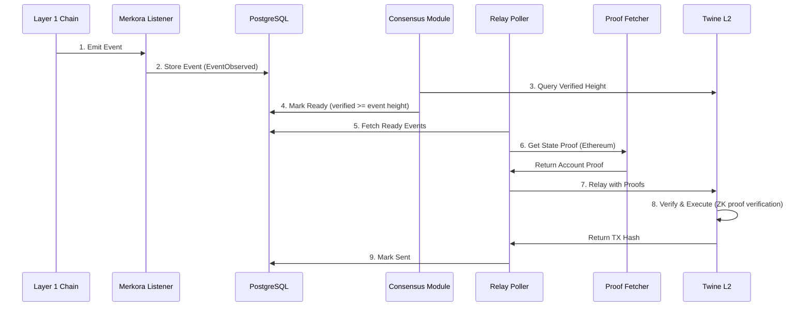

# Merkora: Cross-Chain Relayer

[← Back to Architecture Overview](./Architecture.md)

Merkora is Twine's cross-chain relayer service responsible for monitoring events on Layer 1 blockchains and relaying messages to Twine's execution layer with cryptographic proofs. Built in Rust with a modular crate-based architecture, Merkora provides a robust, fault-tolerant bridge between Layer 1 chains and Twine's Layer 2.

## Trust Minimization

**Key Property**: Merkora is a **service, not a trust assumption**. Users can run their own Merkora instance. All relayed messages are verified by zero-knowledge proofs in Twine contracts—**Merkora cannot forge messages or steal funds**.

Merkora functions as:
- ✅ Event detector and coordinator (no trust required)
- ✅ Proof fetcher and submitter (no trust required)
- ✅ Database for operational state (user-controlled)

**Not**:
- ❌ Trusted oracle (messages verified cryptographically)
- ❌ Bridge operator (no custody of funds)
- ❌ Validator (no attestation power)

## Architecture Components

Merkora is composed of several specialized Rust crates working together:

**Core Crates**:
- **`eth-listener`**: Ethereum event monitoring and block streaming
- **`sol-listener`**: Solana transaction and event monitoring
- **`relayer`**: Core relay logic with proof coordination
- **`database`**: PostgreSQL operations for state persistence
- **`consensus`**: Consensus state tracking for verified heights
- **`twine-client`**: Client for submitting transactions to Twine L2
- **`rpc`**: JSON-RPC server for external interactions
- **`proof-processor`**: Processes and validates Solana consensus proofs
- **`kafka-proof-consumer`**: Consumes consensus proofs from Kafka topics
- **`types`**: Shared data structures and event models
- **`common`**: Configuration, chains, and utilities
- **`metrics`**: Prometheus metrics for observability

## Multi-Chain Event Monitoring

### Ethereum Listener

The Ethereum listener monitors two contracts simultaneously:
- **L1MessageHandler**: Emits `MessageTransaction` events for deposits/withdrawals
- **LayerZero Contract**: Emits `PacketSent` events for cross-chain messaging

**Implementation** (from `eth-listener/src/stream.rs`):

```rust
// Monitors for both MessageTransaction and PacketSent events in same transaction
let filter = Filter::new()
    .address(vec![self.message_queue, self.layer_zero])
    .from_block(current)
    .to_block(to)
    .events([
        MessageTransaction::SIGNATURE_HASH,
        PacketSent::SIGNATURE_HASH,
    ]);
```

**Event Processing Flow**:
1. Stream blocks in batches (100 blocks at a time) until caught up
2. For each block, fetch receipts and filter for relevant events
3. Match `MessageTransaction` with corresponding `PacketSent` from same transaction
4. Extract event data including nonce, addresses, amounts, and message payload
5. Store normalized event in PostgreSQL with status `EventObserved`

**Event Structure** (from contract docs):

```solidity
event MessageTransaction(
    TwineTypes.TransactionType txnType,  // Deposit, Withdraw, Message
    uint64 nonce,
    uint64 chainId,
    uint64 blockNumber,
    address l1Token,
    address l2Token,
    address l1Address,
    address twineAddress,
    uint256 amount,
    bytes message
);
```

### Solana Listener

Monitors the Twine program for events using transaction signature filtering.

**Implementation** (from `sol-listener/src/stream.rs`):

```rust
// Fetch transactions for Twine program in slot range
let transactions = self.rpc
    .get_signatures_for_address(&self.program, min_slot, before_signature, Some(limit))
    .await?;

// For each transaction, fetch full details and parse event logs
for log in logs {
    if let Ok(event) = parse_handle_message_event(&log) {
        // Store event in database
    }
}
```

**Event Processing Flow**:
1. Query Solana RPC for transactions involving Twine program
2. Filter by slot range (configurable batch size, default 100)
3. Wait for confirmations before processing (configurable)
4. Parse program logs to extract `MessageTransactionEvent`
5. Store in PostgreSQL with rolling hash for proof chaining

**Event Structure** (from contract docs):

```rust
pub struct MessageTransactionEvent {
    pub event: String,          // "MessageTransaction"
    pub nonce: u64,
    pub l1_pubkey: String,
    pub twine_address: String,
    pub l1_token: String,
    pub l2_token: String,
    pub chain_id: u64,
    pub amount: String,
    pub data: Vec<u8>,
    pub message_type: String,   // "Deposit", "Withdraw", "Message"
    pub slot_number: u64,
}
```

## Message Relaying

### Cross-Chain Message Flow



### Relay Implementation

**Flow Steps** (from `relayer/src/relay.rs`):

1. **Event Capture**: Listener detects event and stores in database with status `EventObserved`

2. **Consensus Verification**: Consensus module tracks verified heights:
   - Ethereum: Queries Twine's SP1-Helios contract for latest verified block
   - Solana: Tracks latest proof end_slot from database
   - Updates verified heights every 10 seconds

3. **Event Ready Check**: Database operation marks events as `ReadyToSend`:
   ```sql
   UPDATE events 
   SET status = 'ReadyToSend' 
   WHERE chain_id = ? AND block_slot <= ? AND status = 'EventObserved'
   ```

4. **Proof Fetching**:
   - **Ethereum Events**: Fetch EIP-1186 account state proof from Ethereum RPC
   - **Solana Events**: Retrieve ZK proof from database (submitted via RPC or Kafka)

5. **Message Construction**: Build Twine transaction with appropriate handler:
   - **Ethereum**: `handleEthereumProofAndTransactions(messageData, proofHeight, serializedProof)`
   - **Solana**: `handleSolanaTransactions(prevRollingHash, messageData, publicValues, proof)`

6. **Relay to Twine**: Submit transaction (synchronous or asynchronous mode)

7. **State Update**: Mark event as `Sent` in database with transaction hash

**Relay Modes**:

```rust
pub enum SendMode {
    /// Send txn, wait for receipt, then send next (maintains nonce order)
    Synchronous,
    /// Send txn, immediately send next without waiting (parallel execution)
    Asynchronous,
}
```

## State Consistency Maintenance

### Database Schema

**`events` table**: Stores detected L1 events
- `chain_id`, `nonce`: Primary key
- `block_slot`: L1 block/slot number
- `status`: Event processing state
- `message_type`: Deposit/Withdraw/Message
- `txn_hash`: L1 transaction hash
- Event payload: addresses, tokens, amounts, data
- `prev_rolling_hash`: For Solana proof chaining
- `packet_bytes`: LayerZero packet data (Ethereum)

**`proofs` table**: Stores Solana consensus proofs
- `chain_id`: Solana chain identifier
- `start_slot`, `end_slot`: Slot range covered by proof
- `public_value`: ZK proof public inputs
- `proof_blob`: Compressed proof data

### Event Status Lifecycle

```
EventObserved → ReadyToSend → Sending → Sent
                     ↓
                  Failed
```

- **EventObserved**: Event detected and stored in database
- **ReadyToSend**: L1 block verified via consensus proof
- **Sending**: Transaction submitted to Twine (async mode only)
- **Sent**: Transaction confirmed on Twine
- **Failed**: Transaction failed, requires manual intervention

### Consensus State Tracking

From `consensus/src/lib.rs`:

```rust
// Consensus state tracks verified heights for each chain
pub struct ConsensusState<DB> {
    store: DB,
    eth_tx: watch::Sender<u64>,  // Broadcasts Ethereum verified height
    sol_tx: watch::Sender<u64>,  // Broadcasts Solana verified height
}

// Refresher runs every 10 seconds
loop {
    // Query Twine for latest verified Ethereum block
    let eth_latest = twine.latest_verified_block(Chain::Ethereum).await?;
    consensus.update(Chain::Ethereum, eth_latest);
    
    // Query database for latest Solana proof end_slot
    let sol_latest = store.get_latest_slot_till_solana_consensus_verified().await?;
    consensus.update(Chain::Solana, sol_latest);
    
    tokio::time::sleep(Duration::from_secs(10)).await;
}
```

## Proof Integration

### Ethereum State Proofs

Merkora fetches Ethereum account proofs for the L1MessageHandler contract:

```rust
// From eth-listener/src/provider.rs
pub async fn get_msg_hash_state_proof(
    &self,
    nonce: u64,
    at_block: Option<u64>
) -> Result<EIP1186AccountProofResponse> {
    // Fetch account proof from Ethereum RPC
    // Proves storage slot for message queue nonce
}
```

The proof is serialized and included in the Twine transaction for **cryptographic verification by precompiles**.

### Solana Consensus Proofs

Solana proofs are submitted to Merkora via two channels:

**1. JSON-RPC Method**: `twmer_sendProof`

```rust
#[method(name = "twmer_sendProof")]
async fn submit_proof(&self, proof: ZkProof) -> Result<(), ErrorObjectOwned>;
```

**2. Kafka Consumer**: Reads from configured Kafka topic

**Proof Validation** (from `proof-processor/src/lib.rs`):

```rust
// Only accepts Solana consensus proofs
match proof.proof_kind {
    ProofKind::SolanaConsensusProof => {
        // Extract SP1 proof components
        let SP1 { public_value, proof, verification_key, version } = proof.proof_data;
        
        // Store proof in database linked to slot range
        db.insert_proof(chain_id, start_slot, end_slot, public_value, proof).await?;
    }
    _ => return Err("unsupported proof kind"),
}
```

**Proof Chaining** (Solana):

```rust
// Each proof references the previous rolling hash
let prev_rolling_hash = db.get_prev_rolling_hash(chain_id, nonce).await?;

// Submitted to Twine for verification
handleSolanaTransactions(
    prevRollingHash: prev_rolling_hash,
    messageData: event_data,
    publicValues: proof.public_values,
    proof: proof.proof_blob
)
```

## JSON-RPC Interface

Merkora exposes a JSON-RPC server on port 5555 (configurable).

**Available Methods** (from `rpc/src/lib.rs`):

**1. Health Check**:
```json
{
  "jsonrpc": "2.0",
  "method": "health",
  "params": [],
  "id": 1
}
// Returns: "ok"
```

**2. Submit Solana Proof**:
```json
{
  "jsonrpc": "2.0",
  "method": "twmer_sendProof",
  "params": [{
    "proof_kind": "SolanaConsensusProof",
    "proof_data": {
      "SP1": {
        "public_value": "0x...",
        "proof": "0x...",
        "verification_key": "0x...",
        "version": 1
      }
    },
    "identifier": "unique-proof-id"
  }],
  "id": 1
}
```

**Note**: Ethereum proofs are **NOT** accepted via RPC—they are fetched directly from Ethereum RPC by Merkora.

## Configuration

From `config.yaml`:

```yaml
global:
  port: 5555                    # JSON-RPC server port
  log: info                     # Log level
  db-path: ${DATABASE_URL}      # PostgreSQL connection string
  dummy-mode: false             # Skip proof requirements for testing

twine:
  chain-id: 31337
  l2-messenger-contract: 0x...  # L2TwineMessenger address
  sp1-helios: 0x...            # SP1-Helios consensus verifier
  twine-system-storage-contract: 0x...
  rpc: http://...              # Twine RPC endpoint
  private-key: ${PRIVATE_KEY}  # Private key for signing transactions

l1s:
  ethereum:
    name: ethereum
    chain-id: 1
    rpc: https://...           # Ethereum RPC endpoint
    confirmations: 32          # Block confirmations before processing
    start-height: 4338156      # Starting block number
    l1-message-queue: 0x...    # L1MessageHandler contract
    l1-layer-zero: 0x...       # LayerZero endpoint

  solana:
    name: solana-devnet
    chain-id: 900
    batch-size: 100            # Transactions per batch
    start-from: 1497900        # Starting slot number
    program-id: ...            # Twine program address
    rpc-url: http://...        # Solana RPC endpoint
    confirmations: 32          # Slot confirmations
    average-slot-interval: 400 # Milliseconds per slot

kafka:  # Optional
  bootstrap-servers: localhost:9092
  client-id: merkora-proof-consumer
  group-id: merkora
  topic: solana-consensus-proofs

telemetry:
  json: false
  metrics_addr: "127.0.0.1:9108"  # Prometheus metrics endpoint
  log_retention_days: 7
```

## Monitoring & Observability

**Prometheus Metrics** (from `metrics/src/lib.rs`):

- `merkora_current_height{chain_id}`: Latest processed block/slot
- `merkora_events_detected{chain_id}`: Total events detected
- `merkora_events_saved_to_db{chain_id}`: Events stored in database
- `merkora_event_send_ok{source_chain, dest_chain}`: Successful relays
- `merkora_event_send_error{source_chain, dest_chain}`: Failed relays
- `merkora_proof_verified{chain_id, height}`: Consensus proofs verified

**Logging**:
- Structured logging with tracing framework
- Configurable log levels (trace, debug, info, warn, error)
- Daily log rotation with configurable retention (default: 7 days)
- JSON output support for log aggregation

## Trust Minimization Summary

| Component | Trust Required | Verification |
|-----------|---------------|--------------|
| **Event Detection** | None | Verifiable from L1 data |
| **Proof Fetching** | None | Proofs verified cryptographically |
| **Message Relay** | None | ZK proof verification on Twine |
| **Database** | User-controlled | Operational state only |
| **Configuration** | User-controlled | Open-source, auditable |

**Key Property**: Merkora's role is purely operational. It cannot:
- ❌ Forge messages (verified by ZK proofs)
- ❌ Steal funds (no custody)
- ❌ Censor transactions (users can run own instance)
- ❌ Manipulate state (cryptographically verified)

**Users can trust Twine's cross-chain bridge without trusting Merkora.**

## Architecture Benefits

- **Modular Crate Design**: Each component independently testable and deployable
- **Decoupled Monitoring**: L1 listeners operate independently from relay logic
- **Horizontal Scalability**: Multiple relayer instances can share database (future)
- **Fault Tolerance**: PostgreSQL persistence enables crash recovery
- **Multi-Source Proofs**: Accepts proofs from RPC, Kafka, or direct fetch
- **Extensible**: Adding new chains requires implementing listener trait
- **Observable**: Comprehensive metrics and structured logging for production

---

[← Back to Architecture Overview](./Architecture.md)

