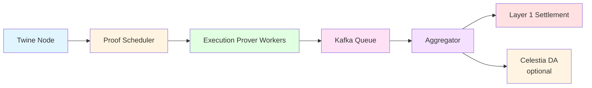

# Proof Orchestration Layer

[← Back to Architecture Overview](./Architecture.md)

The Proof Orchestration Layer coordinates distributed proof generation across multiple prover workers, managing the pipeline from batch creation to Layer 1 settlement.

## Trust Minimization

**Key Property**: Proof orchestration is **operational infrastructure**, not a trust assumption.

**Why Users Don't Need to Trust the Orchestration Layer**:
- ✅ Proofs verified on-chain by Layer 1 settlement contracts
- ✅ Anyone can run prover workers (open-source)
- ✅ Invalid proofs rejected by cryptographic verification
- ✅ Proof generation is deterministic and reproducible

**Trust Minimization**: Orchestration coordinates work; Layer 1 verification provides security.

## Components

### Proof Scheduler

**Job Management**:
- Monitors Twine Node for new batches requiring proofs
- Maintains queue of pending proof generation jobs
- Tracks job status (pending, assigned, proving, completed, failed)
- Implements retry logic for failed proof attempts

**Worker Pool Management**:
- Registers and monitors available prover workers
- Tracks worker capabilities (SP1 vs Risc0, hardware specs, consensus proof support)
- Implements load balancing across heterogeneous workers
- Monitors worker health and disconnects stale workers

**Proof Types Coordination**:
- **L2 Execution Proofs**: Prove correct execution of Twine transaction batches
- **Consensus Proofs**: Generate proofs for Ethereum, Solana, and other Layer 1 chains
- **Aggregation Proofs**: Combine multiple proofs for efficient settlement

**Trust Minimization**: Scheduler cannot forge proofs—only coordinates their generation.

### Execution Prover Workers

**Worker Architecture**:
- Connects to Proof Scheduler to request jobs
- Executes ZKVM proving for assigned batches
- Uses hardware acceleration when available (CUDA for Nvidia GPUs)
- Returns completed proofs to scheduler via Kafka

**Proof Generation Process**:
1. Request job from Proof Scheduler
2. Fetch batch data from Twine Node
3. Execute proving using SP1 or Risc0 internally
4. Generate cryptographic proof of correct execution
5. Compress proof to Groth16 format
6. Submit completed proof to Kafka topic

**Resource Management**:
- Prover workers can be scaled horizontally for throughput
- Support for both CPU and GPU proving
- Configurable concurrency per worker
- Resource pooling for large proof generation

**Trust Minimization**: Workers are stateless and replaceable. Anyone can run workers.

### Aggregator

**Proof Validation**:
- Consumes proofs from Kafka topic where Proof Scheduler publishes
- Verifies proof correctness before submission to Layer 1
- Validates proof public inputs match expected state roots
- Checks proof format compatibility with settlement contracts

**Multi-Chain Settlement Dispatch**:
- Prepares settlement transactions for multiple Layer 1 chains
- Includes proof, public inputs, and batch metadata
- Signs and submits transactions to Layer 1 settlement contracts
- Monitors transaction confirmation and finality

**Trust Minimization**: Aggregator cannot create invalid proofs. Layer 1 verification is the trust anchor.

## Pipeline Workflow

**Trust Minimization**: Pipeline is transparent and verifiable at every step. Final verification happens on-chain.

---

[← Back to Architecture Overview](./Architecture.md)
